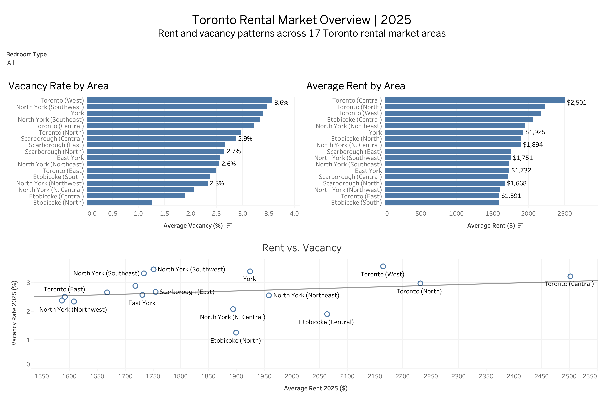

# Toronto Rental Market Analyzer

An end to end data analysis project examining rental prices and vacancy rates across 17 Toronto rental market areas using CMHC rental market data

The project uses Excel for data preparation, MySQL for querying and analysis, Python for statistical exploration and visualization, and Tableau for interactive dashboard reporting

## Project Overview

Toronto's rental market varies considerably by location and unit type. This project analyzes average rents and vacancy rates across Toronto rental market areas to better understand differences in affordability, availability, and market conditions.

The analysis focuses on four unit types:

- Studio
- 1 Bedroom
- 2 Bedroom
- 3 Bedroom+

Data from 2024 and 2025 is used to examine both current market conditions and year-over-year changes.

## Business Questions

This project explores the following questions:

1. Which Toronto rental market areas have the highest and lowest average rents?
2. Which areas have the highest and lowest vacancy rates?
3. How did rents and vacancy rates change from 2024 to 2025?
4. Is there a relationship between rental prices and vacancy rates?
5. Do these relationships differ by bedroom type?

## Tools Used

| Tool | Purpose |
|---|---|
| Excel | Data cleaning, restructuring, and validation |
| MySQL | SQL querying, joins, rankings, aggregations, and market analysis |
| Python | Data validation, merging, correlation analysis, and visualization |
| Tableau | Interactive dashboard and final data visualization |
| GitHub | Project documentation and version control |

## Data Source

Data was obtained from the Canada Mortgage and Housing Corporation (CMHC) 2025 Rental Market Report for Toronto.

The analysis uses:

- Average rents by rental market area and bedroom type
- Vacancy rates by rental market area and bedroom type
- 2024 and 2025 market estimates

CMHC-suppressed or unavailable estimates were retained as missing values rather than being replaced with zero.

## Data Preparation

The original CMHC tables required cleaning and restructuring before analysis.

The main preparation steps included:

- Selecting the 17 Toronto rental market areas
- Standardizing bedroom type categories
- Converting the original tables into analysis-ready datasets
- Preserving suppressed observations as missing values
- Calculating dollar and percentage changes in rent
- Calculating percentage-point changes in vacancy
- Validating the final merge by zone and bedroom type

The final combined dataset contains **68 observations**, representing 17 rental market areas and four bedroom types.

## SQL Analysis

MySQL was used to explore the cleaned rental market data and answer questions such as:

- Average rent by bedroom type
- Highest and lowest rental areas
- Rent rankings within bedroom types
- Year-over-year rent changes
- Vacancy rate comparisons
- Combined rent and vacancy analysis

SQL techniques used include:

- `GROUP BY`
- Aggregate functions
- `CASE` statements
- Joins
- Common Table Expressions (CTEs)
- Window functions and `RANK()`

## Python Analysis

Python was used to combine the rent and vacancy datasets and examine relationships that were less practical to evaluate using SQL alone.

Libraries used:

```python
import pandas as pd
import matplotlib.pyplot as plt
```

The analysis included:

- Data validation
- Missing-value checks
- Dataset merging
- Correlation analysis
- Bedroom-type segmentation
- Scatterplot visualization
- Year-over-year analysis
- Sensitivity analysis

## Key Findings

- Rent and vacancy relationships differed depending on bedroom type, suggesting that Toronto's rental market does not behave as one uniform market.

- For one-bedroom units, Toronto (Central) had the highest average rent and one of the lowest vacancy rates, although vacancy alone did not consistently explain differences in rent across areas.

- Across the combined dataset, there was almost no linear relationship between year-over-year changes in rent and vacancy rates (`r = 0.011`).

- When analyzed separately, one-bedroom units showed a weak-to-moderate positive relationship between rent and vacancy changes (`r = 0.316`), while studio units showed a moderate negative relationship (`r = -0.498`).

- The results demonstrate why segmenting the market by unit type can reveal patterns that are hidden when all observations are analyzed together.

> Correlations in this project describe associations and should not be interpreted as evidence that vacancy rates cause changes in rental prices.

## Tableau Dashboard

The interactive Tableau dashboard allows users to compare rental market conditions across Toronto areas and bedroom types.

Dashboard features include:

- 2025 average rent rankings
- 2025 vacancy rate rankings
- Rent vs. vacancy scatterplot
- Linear trend analysis
- Interactive bedroom-type filtering
- Area-level tooltips



## Repository Structure

```text
Toronto-Rental-Market-Analyzer/
│
├── data/
│   ├── clean_rent_data.csv
│   ├── clean_vacancy.csv
│   └── toronto_rental_combined.csv
│
├── excel/
│   └── Toronto Rental Data.xlsx
│
├── sql/
│   └── toronto_rental_analysis.sql
│
├── python/
│   └── toronto_rental_analysis.ipynb
│
├── tableau/
│   ├── Toronto_Rental_Market_Dashboard.twbx
│   └── Toronto_Rental_Market_Dashboard.png
│
└── README.md
```

## Project Workflow

```text
CMHC Rental Market Data
        ↓
Excel — Data Cleaning
        ↓
MySQL — Querying & Analysis
        ↓
Python — Statistical Exploration
        ↓
Tableau — Interactive Dashboard
```

## Skills Demonstrated

**Data Cleaning:** Excel, missing-value handling, data validation  
**SQL:** Joins, aggregations, CTEs, CASE statements, window functions  
**Python:** pandas, matplotlib, correlation analysis, data visualization  
**Tableau:** Interactive dashboards, filters, trend lines, tooltips  
**Analytics:** Market segmentation, year-over-year analysis, interpretation of relationships
